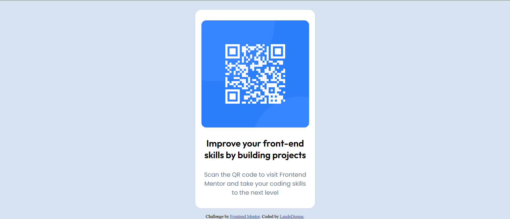

# qr-code
## 📷 **Project overview**

  

🔗 **[Voir le projet en ligne](https://ton-url-deploy.com)**

## 📌 Project description

This project is an implementation of a QR Code component based on a challenge from [Frontend Mentor](https://www.frontendmentor.io). It consists of a card containing a QR code that redirects the user to an on-line resource.

The aim is to improve HTML and CSS skills by creating a clean, responsive and aesthetically pleasing layout.

## 📋 Project objectives

✅ Apply best practices in HTML and CSS.

✅ Create a responsive layout adapted to mobiles and desktops.

✅ Use Flexbox for a fluid, well-aligned structure.

✅ Integrate Google Fonts for a professional look.

## 🎨 Conception & Design
🖼 Central card with QR Code
- 🎨 Harmonious colors based on a sober theme

- 📱 Responsive for adaptation to different screens

- ✨ Polices modernes (Outfit, Poppins, Roboto, Young Serif)

## 🚀 Technologies used
- HTML5 : Content structure

- CSS3 : Formatting and responsiveness

- Google Fonts : Stylish typography

This project is ideal for beginner developers wishing to practice page layout with CSS Flexbox and optimization for mobile screens. 🔥
